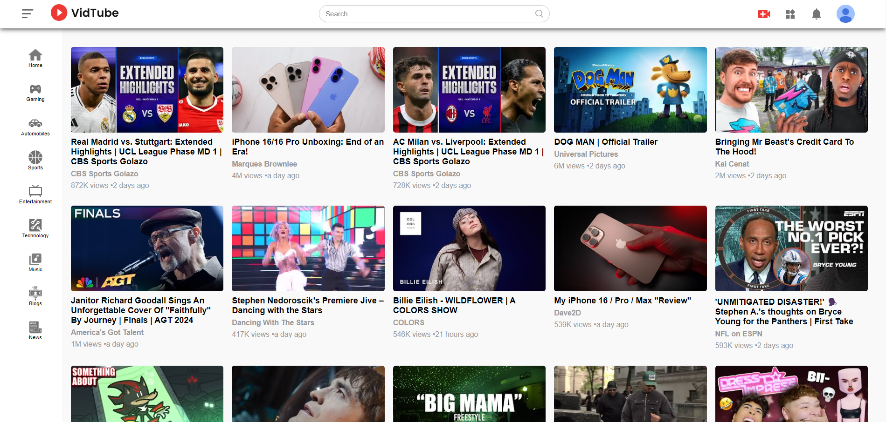
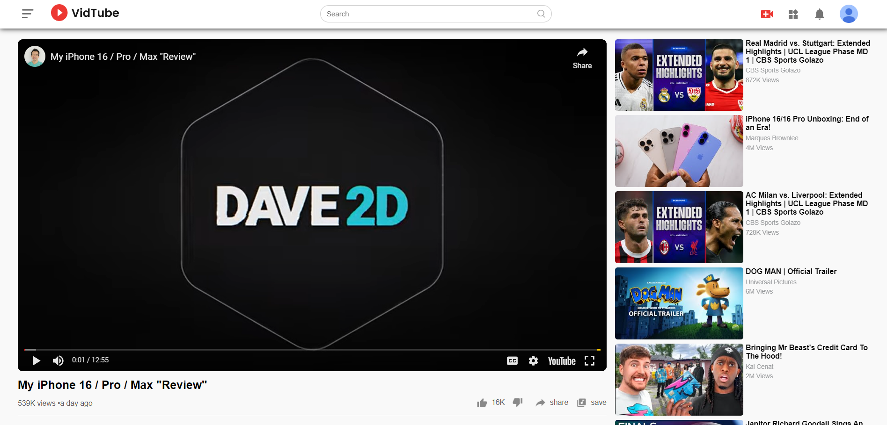
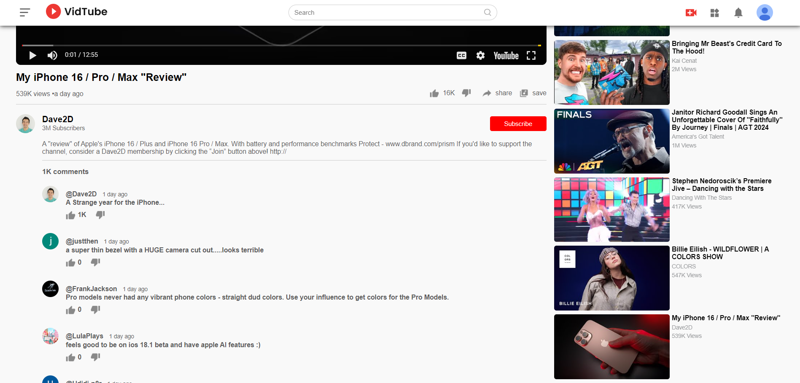

# YouTube Clone

This project is a front-end implementation of a YouTube-like application. Built with React, CSS, and HTML, it aims to replicate core features of YouTube, including video playback and user interaction.

## Table of Contents

- [Features](#features)
- [Usage](#usage)
- [Preview](#preview)
  - [Home Page](#home-page)
  - [Video Play Page](#video-play-page)
  - [Comment Section](#comment-section)
- [Deployment](#deployment)
- [Contact](#contact)
- [Acknowledgments](#acknowledgments)

## Features

- **Video Playback**: Stream videos with controls for play, pause, and seek.
- **Video Thumbnails**: Display video thumbnails for easy browsing.
- **Responsive Design**: Optimized for various screen sizes and devices.
- **Interactive UI**: Includes animations and dynamic elements for a better user experience.

## Usage

- **Home Page**: Browse video thumbnails and interact with the video player.
- **Video Page**: Watch videos, view details, and interact with video controls.

## Preview

### Home Page

  
*The home page displays video thumbnails and provides access to video playback.*

### Video Play Page

  
*The video play page includes video playback controls and video details.*

### Comment Section

  
*The comment section allows users to view and interact with comments on the video.*

## Deployment

The project is deployed and accessible at [https://rohanbhoge.github.io/youtube-clone/](https://rohanbhoge.github.io/youtube-clone/). 

## Contact

- **Your Name** - [bhogerohan60@example.com](mailto:bhogerohan60@example.com)
- **GitHub**: [https://github.com/RohanBhoge](https://github.com/RohanBhoge)

## Acknowledgments

- Thanks to the React community for the excellent documentation and support.
- Inspiration from various open-source projects and YouTube’s UI/UX design.
